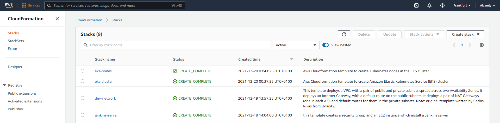

# Capstone Project - Udacity DevOps Nanodegree 

## Project Overview

In this project we will apply the skills and knowledge which were developed throughout the Cloud DevOps Nanodegree program. These include:

- Working in AWS
- Using Jenkins to implement Continuous Integration and Continuous Deployment
- Building pipelines
- Working with CloudFormation to deploy clusters
- Building Kubernetes clusters
- Building Docker containers in pipelines.

## Steps in Completing the Project
### Step 1: Propose and Scope the Project
- For the Docker application, we use a Java application (Spring-boot) under the `src` folder.
- For Deployment type, rolling deployment has been chosen as a deployment strategy.
- We use Jenkins to mplement Continuous Integration and Continuous Deployment

The Jenkins pipeline will perform the following operations:
* linting the Dockerfile.
* Compile the application.
* Execute tests.
* Build a docker image.
* Push the docker image to the docker registry.
* Deploy the container to kubernetes on rolling deployment service. 

### Step 2: Use Jenkins, and implement rolling deployment. 
Create Jenkins server and install the plugins we used. We used CloudFormation to build our infrastructure; i.e. the network, the Jenkins server, the Kubernetes Cluster and Kubernetes nodes. We prepared a shell script to create AWS stacks. We called it `create-cluster.sh` under the `scripts` folder.

- Create network stack. This stack deploys the network infrastructure.

    ```bash
    scripts/create-stack.sh dev-network infrastructure/network/network.yml infrastructure/network/network-parameters.json
    ```
- Create jenkins-server stack. This stack deploys an auto scaling group with a launch configuration with all the resources necessary to run a Jenkins server.

    ```bash
    scripts/create-stack.sh jenkins-server infrastructure/jenkins/jenkins-server.yml infrastructure/jenkins/jenkins-server-parameters.json
    ```
- Set up the environment to which we will deploy code.
- Install the following plugins in Jenkins:
  - CloudBees AWS Credentials
  - Pipeline: AWS Steps
  - Blue Ocean
- Add AWS credentials
- Add Docker credentials

### Step 3: Pick AWS Kubernetes as a Service.
We used CloudFormation to deploy the Kubernetes Cluster and the node group inside it. We created 2 stacks as follows:

- Stack deploys the Kubernetes Cluster

    ```bash
    scripts/create-stack.sh eks-cluster infrastructure/kubernetes/eks-cluster.yml infrastructure/kubernetes/eks-cluster-parameters.json
     ```
 - Stack deploys node group inside that Cluster
 
    ```bash 
    scripts/create-stack.sh eks-nodes infrastructure/kubernetes/eks-nodes.yml  infrastructure/kubernetes/eks-nodes-parameters.json
     ```
**CloudFormation stacks**



**EKS cluster with one node in AWS**


### Step 4: Build pipeline
- Create a pipeline using the Blue Ocean plugin in Jenkins.
- All the steps that the pipeline includes are in the [Jenkinsfile](Jenkinsfile)

### Step 5: Test pipeline
- Perform builds on the pipeline.


- AWS EC2 Instances


## Project Structure

    ```
    ├── Dockerfile
    ├── Jenkinsfile
    ├── pom.xml
    ├── README.md
    ├── src
    │   ├── main/java/com/example/demo
    |   |                         ├── controller
    |   |                         |   └── WebController.java
    │   |                         └── DemoApplication.java   
    |   └── test/java/com/example/demo
    |                              └── DemoApplicationTests.java
    ├── infrastructure
    │   ├── kubernetes
    │   │   ├── eks-cluster.yml
    │   │   ├── eks-cluster-parameters.json 
    │   │   ├── eks-nodes.yml
    │   │   └── eks-nodes-parameters.json
    │   ├── jenkins
    │   │   ├── jenkins-server-parameters.json
    │   │   └── jenkins-server.yaml
    │   └── network
    │       ├── network-parameters.json
    │       └── network.yml
    ├── kubernetes
    │   └── deployment.yml
    └── scripts
        ├── deploy_kubernetes.sh
        ├── run_docker.sh
        ├── run_kubernetes.sh
        └── upload_docker.sh
    ```
    
### Links & Resources
* [**Jenkins User Documentation**](https://www.jenkins.io/doc/)
* [**Creates an Amazon EKS control plane**](https://docs.aws.amazon.com/AWSCloudFormation/latest/UserGuide/aws-resource-eks-cluster.html)
